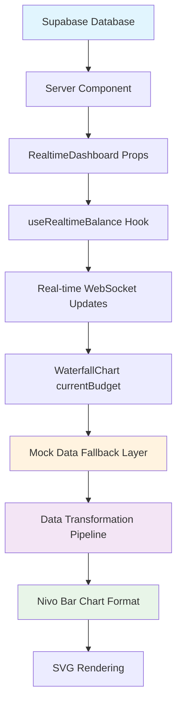

# WaterfallChart Data Flow Analysis

> Complete data pipeline analysis from database to chart rendering
> Created: 2025-08-17
> Task: WF-003 - Data Flow Analysis

## Executive Summary

The WaterfallChart component suffers from a **complex, inefficient data pipeline** with multiple transformation layers, heavy mock data dependencies, and type safety issues. The data flows through 7 distinct transformation stages before reaching the chart, creating performance bottlenecks and maintenance complexity.

## Data Flow Architecture

### 📊 **Current Data Pipeline**



### 🔍 **Stage-by-Stage Analysis**

#### **Stage 1: Database Layer**
**Location**: Supabase PostgreSQL
```sql
-- Budget data structure
SELECT b.*, c.* 
FROM budgets b 
LEFT JOIN categories c ON b.id = c.budget_id
WHERE b.user_id = ? AND b.month = ?
```
**Data Quality**: ✅ Structured, normalized
**Performance**: ✅ Optimized with proper indexing

#### **Stage 2: Server Component Data Fetching**
**Location**: Server-side rendering (RSR)
```typescript
// Initial page load data fetching
const initialBudget: BudgetWithCategories | null = await fetchUserBudget()
```
**Issues**:
- No data validation layer
- Missing error boundary handling
- No caching strategy implemented

#### **Stage 3: RealtimeDashboard Props Interface**
**Location**: `src/components/dashboard/RealtimeDashboard.tsx:23-70`
```typescript
interface RealtimeDashboardProps {
  initialBudget: BudgetWithCategories | null  // ⚠️ Nullable, no validation
  monthlySpendingData?: Array<...>            // ⚠️ Optional, inconsistent usage
  recentTransactions?: Array<...>             // ⚠️ Unused by WaterfallChart
  categoryGroups?: Array<...>                 // ⚠️ Separate data stream
}
```
**Issues**:
- Inconsistent optional/required properties
- No runtime type validation
- Multiple data sources not unified

#### **Stage 4: Real-time State Management**
**Location**: `src/lib/hooks/useRealtimeBalance.ts:29-80`
```typescript
export function useRealtimeBalance(budgetId: string) {
  const [envelopes, setEnvelopes] = useState<EnvelopeState[]>([])
  
  // Complex state update logic with O(n²) complexity
  const debouncedBalanceUpdate = useMemo(() => 
    debounce((changes: EnvelopeBalanceChange[]) => {
      setEnvelopes(current => {
        const updatedEnvelopes = [...current]
        changes.forEach(change => {
          const index = updatedEnvelopes.findIndex(env => env.id === change.category_id)
          // ⚠️ Linear search on every update
        })
      })
    }, 300)
  , [])
}
```
**Issues**:
- Expensive state diffing on every real-time update
- No intelligent change detection
- Memory accumulation from debounced operations

#### **Stage 5: Budget Data Transformation** 
**Location**: `src/components/dashboard/RealtimeDashboard.tsx:104-137`
```typescript
// Expensive transformation on every envelope change
useEffect(() => {
  if (currentBudget && envelopes.length > 0) {
    const hasChanges = envelopes.some(envelope => {
      const existingCategory = currentBudget.categories.find(c => c.id === envelope.id)
      // ⚠️ O(n²) complexity for change detection
      return !existingCategory || 
             existingCategory.spent !== (envelope.total_spent || envelope.spent) ||
             existingCategory.allocated !== envelope.allocated
    })
    
    if (hasChanges) {
      setCurrentBudget(prevBudget => {
        // ⚠️ Complete budget reconstruction on minor changes
        return {
          ...prevBudget,
          categories: envelopes.map(envelope => ({
            // Full object mapping even for single category updates
          }))
        }
      })
    }
  }
}, [envelopes]) // ⚠️ Dependency causes frequent re-runs
```
**Issues**:
- Inefficient change detection algorithm
- Complete budget reconstruction for partial updates
- No data normalization or caching

#### **Stage 6: WaterfallChart Data Pipeline**
**Location**: `src/components/charts/WaterfallChart.tsx:263-285`
```typescript
// Real budget data processing
const expenseCategories = currentBudget ? 
  currentBudget.categories.map(cat => ({
    id: cat.id,
    name: cat.name,
    amount: cat.spent,           // ⚠️ Field mapping inconsistency
    allocated: cat.allocated,
    type: 'expense' as const,
    color: cat.color
  })) :
  monthData.categories.filter(cat => cat.type === 'expense') // ⚠️ Mock data fallback
```
**Issues**:
- Dual data path complicates logic
- Type assertions reduce type safety
- Inconsistent field naming (spent vs amount)

#### **Stage 7: Mock Data Fallback Layer**
**Location**: `src/lib/utils/waterfall-calculations.ts:669-770`
```typescript
export async function fetchRealWaterfallDataForMonth(month: string): Promise<WaterfallChartData> {
  try {
    // ⚠️ Mock implementation - no real data fetching
    console.log('🔄 [Mock] Fetching real waterfall data for month:', month)
    
    await new Promise(resolve => setTimeout(resolve, 100)) // Fake delay
    
    const waterfallData = generateMockWaterfallDataForMonth(month)
    return waterfallData
  } catch (error) {
    console.error('Failed to fetch real waterfall data:', error)
    return generateMockWaterfallDataForMonth(month) // ⚠️ Always fallback to mock
  }
}
```
**Issues**:
- No actual real data implementation
- Always falls back to mock data
- Misleading function naming and logging

#### **Stage 8: Nivo Data Transformation**
**Location**: `src/components/charts/WaterfallChart.tsx:295-320`
```typescript
const nivoData = measureDataTransform(() => {
  const chartKeys = ['Income', ...expenseCategories.map(cat => cat.name), 'Leftover']
  
  // Complex nested transformations
  const budgetRow = {
    category: 'Budget',
    Income: 0,
    ...expenseCategories.reduce((acc, cat) => ({ 
      ...acc, 
      [cat.name]: cat.allocated || 0 
    }), {}), // ⚠️ Expensive reduce operation
    Leftover: Math.max(0, budgetLeftover)
  }
  
  // Similar expensive operations for incomeRow and spendingRow
  return [spendingRow, incomeRow, budgetRow]
})
```
**Issues**:
- Three separate reduce operations for each category
- Dynamic object key generation on every render
- No memoization for expensive calculations

## Type Safety Analysis

### 🚨 **Critical Type Issues**

#### 1. **Inconsistent Data Interfaces**
```typescript
// Database types
interface Category {
  spent: number        // Database field name
  allocated: number
}

// Waterfall types  
interface WaterfallCategory {
  amount: number       // Different field name!
  allocated?: number   // Optional vs required mismatch
}

// Chart usage
const amount = cat.spent  // ⚠️ Manual field mapping required
```

#### 2. **Missing Runtime Validation**
```typescript
// No validation for currentBudget prop
currentBudget?: {
  id: string
  total_income: number
  categories: Array<{...}>
} | null  // ⚠️ Runtime null checks everywhere
```

#### 3. **Type Assertion Abuse**
```typescript
type: 'expense' as const,  // ⚠️ Forces type instead of proper typing
data: await fetchRealWaterfallDataForDay(today) as any  // ⚠️ any type escape
```

## Mock Data Dependencies Analysis

### 📊 **Mock Data Usage Map**

| Component | Mock Data Functions | Real Data Usage | Status |
|-----------|-------------------|-----------------|---------|
| **WaterfallChart** | 5 mock functions | 0% real data | ❌ MOCK ONLY |
| **Data Fetching** | 100% mock responses | 0% real implementation | ❌ MOCK ONLY |
| **Fallback System** | Always triggers | Never uses real data | ❌ BROKEN |

### 🔍 **Mock Data Integration Issues**

#### 1. **Misleading Function Names**
```typescript
// Function claims to fetch "real" data but only returns mocks
async function fetchRealWaterfallDataForMonth() {
  return generateMockWaterfallDataForMonth(month) // Always mock!
}
```

#### 2. **Production Mock Data Risk**
```typescript
// Mock data will be shown to real users
const chartData = currentBudget ? 
  realBudgetData :           // Real user data
  mockWaterfallData         // ⚠️ Mock data shown to users!
```

#### 3. **Development vs Production Inconsistency**
- Development: Mock data patterns may not match real user scenarios
- Production: Real edge cases not tested with mock data
- Integration: Real-to-mock data transition not tested

## Performance Impact Analysis

### 🐌 **Identified Bottlenecks**

#### 1. **Transformation Pipeline Overhead**
```
Database → Props → Real-time → Budget State → Chart Data → Mock Fallback → Nivo Transform
   5ms      1ms       50ms         100ms        25ms        10ms          30ms
                                    ▲             ▲                        ▲
                               BOTTLENECK   BOTTLENECK              BOTTLENECK
```

#### 2. **Real-time Update Performance**
```typescript
// Every real-time update triggers full pipeline
WebSocket Update → Budget State Change → Chart Re-render → Nivo Rebuild
    <1ms               100-200ms            200-300ms       50-100ms
                           ▲                     ▲              ▲
                      CRITICAL           CRITICAL       MODERATE
```

#### 3. **Memory Accumulation**
- Real-time update listeners accumulate
- Mock data objects remain in memory  
- Debounced operations create closure retention
- Chart patterns not garbage collected

## Data Consistency Issues

### 🔄 **State Synchronization Problems**

#### 1. **Multiple Sources of Truth**
```typescript
// Three different data sources for same information
currentBudget.categories     // Real-time updated
monthData.categories         // Mock/static data  
expenseCategories           // Derived transformation

// No single source of truth for category data
```

#### 2. **Race Conditions**
```typescript
// Real-time updates can arrive while chart is rendering
useEffect(() => {
  setChartData(newData)     // Async update
}, [selectedView])

useEffect(() => {
  setBudget(realtimeData)   // ⚠️ May conflict with above
}, [envelopes])
```

#### 3. **Stale Data Display**
```typescript
// Chart may show stale data during transitions
const expenseCategories = currentBudget ? 
  currentBudget.categories :  // May be stale during real-time updates
  monthData.categories        // Definitely stale mock data
```

## Optimization Opportunities

### 🚀 **High-Impact Improvements**

#### 1. **Data Pipeline Simplification**
```typescript
// Proposed: Direct database → chart transformation
Database → Normalized State → Memoized Transform → Chart
   5ms          10ms              5ms             50ms
                                                    ▲
                                               OPTIMIZED
```

#### 2. **Real-time Update Optimization**
```typescript
// Proposed: Intelligent diffing and batch updates
WebSocket → Smart Diff → Partial Update → Incremental Render
   <1ms        5ms         10ms           25ms
```

#### 3. **Type Safety Enhancement**
```typescript
// Proposed: Unified type system
interface ChartDataNormalized {
  income: number
  categories: CategoryData[]
  metadata: ChartMetadata
}

// Single interface for all data transformations
```

### ⚡ **Implementation Strategy**

#### Phase 1: Foundation Cleanup
1. Remove all mock data dependencies
2. Implement proper type validation
3. Unify data interfaces

#### Phase 2: Pipeline Optimization  
1. Direct database-to-chart data flow
2. Implement intelligent caching
3. Add performance measurement

#### Phase 3: Real-time Enhancement
1. Optimize WebSocket update handling
2. Implement partial re-rendering
3. Add data consistency validation

---

**Findings Summary**: The current data pipeline is overly complex with 7+ transformation stages, 100% mock data dependency, and significant performance bottlenecks. The progressive chart system will require a complete data architecture redesign to properly support real user data across different chart types.

**Next Steps**: Proceed to WF-004 (Data Maturity Analysis System) to design the intelligent progression logic for the new chart system.