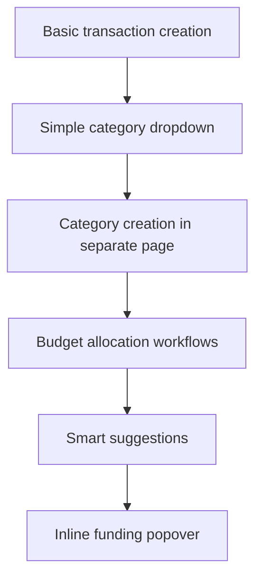

# 📋 **Category Creation in Transaction Form - Postmortem**

## 🎯 **What We Tried To Build**

An enhanced category creation experience where users could:
1. Enter a transaction with a new category name (e.g., "Coffee")
2. See an intelligent funding popover appear
3. Automatically allocate budget from other categories
4. Complete the transaction seamlessly

**Goal**: Zero context-switching, intelligent budget reallocation, seamless UX

## ❌ **What Went Wrong**

### **1. Complexity Cascade**
The feature required coordination between **too many moving parts**:
- `SmartCategoryDropdown` (category suggestions)
- `CategoryService` (smart suggestions with database tables)
- `BudgetReallocationService` (funding logic)
- `CategoryFundingPopover` (funding UI)
- `InlineTransactionEditor` (transaction editing)
- `RealtimeTransactionForm` (transaction creation)
- Multiple database tables and functions

### **2. Race Conditions & State Management**
**React Error #130**: Classic state management nightmare
- Category creation → State update → Component re-render with inconsistent data
- Real-time updates conflicting with optimistic updates
- Multiple async operations modifying shared state simultaneously
- Components trying to render with `null`/`undefined` category data

### **3. Database Schema Dependencies**
**406 Not Acceptable errors**: Feature required tables that didn't exist
- `category_keywords`, `category_usage`, `recent_categories` etc.
- CategoryService trying to access non-existent tables
- Database migrations not applied in correct sequence
- Development environment out of sync with code expectations

### **4. Trigger Conflicts**
**Database trigger errors**: "record 'new' has no field 'updated_at'"
- Custom triggers conflicting with Supabase's built-in functionality
- Manual spent amount updates needed after removing triggers
- Database function complexity vs application logic tradeoffs

### **5. JSX Syntax Errors**
**Compilation failures**: `.filter(Boolean)` outside JSX context
- Complex conditional rendering with chained operations
- Mixing JavaScript array methods with JSX expressions incorrectly

## 🔍 **Root Cause Analysis**

### **Primary Issue: Feature Too Large for Context**
We tried to implement a **complex budget reallocation system** inside a **simple transaction form**. This violated the **single responsibility principle** and created:
- **Tight coupling** between unrelated concerns
- **Complex state dependencies** across multiple components  
- **Error propagation** where any part failing broke the whole flow

### **Secondary Issue: Premature Implementation**
We built the **advanced funding UI** before ensuring:
- Basic transaction creation worked reliably
- Category management was stable
- Database schema was properly deployed
- Error handling was comprehensive

## 📊 **Error Patterns Observed**

| Error Type | Frequency | Impact | Root Cause |
|------------|-----------|---------|------------|
| React Error #130 | High | Critical | State management race conditions |
| 406 Database Errors | High | High | Missing database tables |
| JSX Compilation | Medium | Critical | Syntax errors in complex expressions |
| Trigger Conflicts | Medium | High | Database function complexity |
| Type Errors | Low | Medium | Complex prop passing between components |

## ✅ **What We Should Have Done**

### **1. Incremental Implementation**

### **2. Separation of Concerns**
- **Transaction forms**: Only handle transaction CRUD
- **Category management**: Separate pages/components
- **Budget allocation**: Dedicated workflow, not inline

### **3. Database-First Approach**
- Deploy schema changes **before** implementing features
- Test database functions **independently**
- Ensure migrations work in all environments

### **4. Error-Resilient Design**
- Each component should work **independently**
- Graceful degradation when advanced features fail
- Clear error boundaries and fallback states

## 🚀 **Recommended Alternative Approach**

### **Simple & Reliable Flow:**
1. **Transaction form**: Only allows selecting existing categories
2. **"Create Category" button**: Links to dedicated category creation page
3. **Category creation page**: Handles funding allocation properly
4. **Return to transaction**: With new category available

### **Benefits:**
- ✅ **Single responsibility** per component
- ✅ **Clear error isolation** 
- ✅ **Predictable state management**
- ✅ **Easy to test and debug**
- ✅ **Progressive enhancement** possible

## 📚 **Lessons Learned**

1. **Keep transaction forms simple** - they're critical user paths
2. **Build complex features separately** before integrating
3. **Database schema must be deployed first**
4. **React state management requires careful sequencing**
5. **User feedback was correct** - the complexity wasn't worth it

## 🔧 **Current State**

**Category creation in transaction forms is now DISABLED**:
- `allowCategoryCreation={false}` in all forms
- `onCategoryCreate={undefined}` prevents accidental calls
- Users must create categories through dedicated flows
- Transaction forms are stable and reliable

## 🎯 **Future Recommendations**

If we want to implement enhanced category creation:

1. **Build it as a separate feature first**
2. **Test extensively in isolation**  
3. **Ensure database schema is stable**
4. **Add comprehensive error handling**
5. **Consider simpler alternatives** (like category templates)

**The user was right to reject this approach.** Sometimes the simpler solution is the better solution.